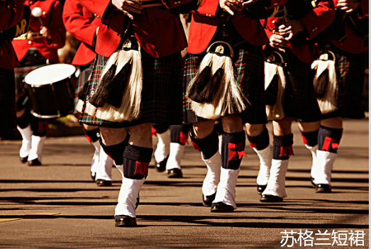

####男人穿裙子的习俗：
  * 中国商代
  * 苏格兰：Scotland
  * 苏格兰短裙：kilt

####美国人名字：
  * 名(first name)+名(middle name)+姓（family name）
  * first name：教名，受法律承认的正式名字
  * middle name：父母或亲戚所取，通常缩写表示
  * family name：家族世代相传的名字