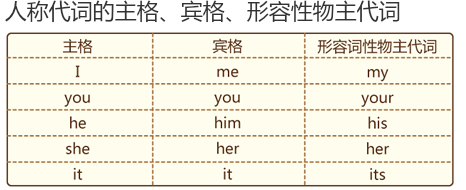
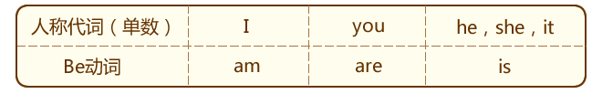
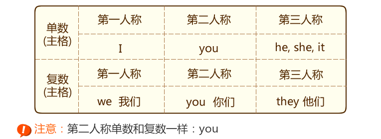

#解释
  * 主语：一个动作的发出者
  * 宾语：一个动作的承受人；对象
  * 表语：主语的身份、性质、品性、特征和状态

主谓宾结构：主语+谓语+宾语组成
主系表结构：主语+系动词+表语

###人称

####所有格
主要是用来表示所属
在名词后加上's来表示所属关系，'s前名词：有生命的东西，偶尔没有生命的物体。
  * Tim's shirt.
  * the party's policy